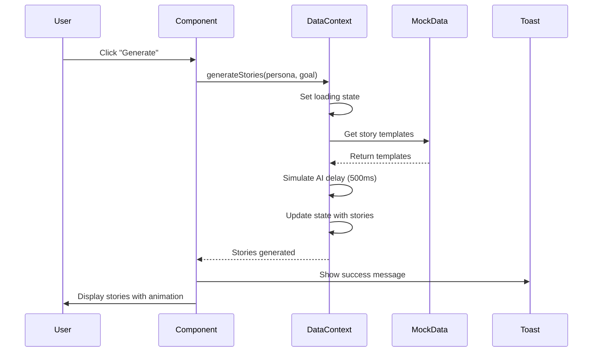

# Design Document

## Overview

Ten dokument opisuje architekturę i implementację rozszerzeń dla aplikacji Syzio Canis (Demo6). Głównym celem jest wzbogacenie aplikacji o realistyczne dane mockowe i interaktywne akcje, które pokażą pełne możliwości systemu w środowisku demonstracyjnym.

Rozwiązanie będzie oparte na istniejącej architekturze z React Context API, rozszerzając `mock-data.ts` oraz dodając nowe funkcje do `data-context.tsx`.

## Architecture

### High-Level Architecture

```
┌─────────────────────────────────────────────────────────────┐
│                    Canis Main View                          │
│  ┌──────────┬──────────┬──────────┬──────────┬──────────┐  │
│  │  Chat    │ Stories  │TestData  │ Verify   │Release   │  │
│  └──────────┴──────────┴──────────┴──────────┴──────────┘  │
└─────────────────────────────────────────────────────────────┘
                            │
                            ▼
┌─────────────────────────────────────────────────────────────┐
│                    Data Context (State)                     │
│  • chatThreads (extended)                                   │
│  • generatedStories (with conflicts)                        │
│  • testDatasets (multiple schemas)                          │
│  • findings (expanded)                                      │
│  • releases (with detailed info)                            │
└─────────────────────────────────────────────────────────────┘
                            │
                            ▼
┌─────────────────────────────────────────────────────────────┐
│                    Mock Data Layer                          │
│  • Extended chat threads (5+)                               │
│  • Story templates with conflicts                           │
│  • Test data generators per schema                          │
│  • Finding examples (all types)                             │
│  • Release data with commits & coverage                     │
└─────────────────────────────────────────────────────────────┘
```

### Component Interaction Flow



## Components and Interfaces

### 1. Extended Mock Data Structure

#### New Chat Threads

Dodamy 3 nowe wątki do istniejących 2:

```typescript
// lib/demo6/mock-data.ts - rozszerzenie
export const additionalChatThreads: ChatThread[] = [
  {
    id: "t-3",
    title: "Walidacja karty",
    preview: "Algorytm Luhn dla PAN...",
    messages: [
      {
        id: "msg-4",
        role: "user",
        content: "Jak walidować numer karty kredytowej?",
        timestamp: "2025-10-11T09:00:00Z",
      },
      {
        id: "msg-5",
        role: "ai",
        content: "Używamy algorytmu Luhn do walidacji PAN. Dodatkowo sprawdzamy BIN (pierwsze 6 cyfr) dla identyfikacji wydawcy karty.",
        citations: [
          {
            source: "payments.yaml validation",
            fragment: "pan: { validator: 'luhn', binCheck: true }",
            confidence: 0.94,
          },
        ],
        timestamp: "2025-10-11T09:01:00Z",
      },
    ],
    context: {
      projectId: "proj-1",
      documents: ["payments.yaml", "CardValidation.md"],
    },
  },
  {
    id: "t-4",
    title: "Obsługa błędów płatności",
    preview: "Retry policy i fallback...",
    messages: [
      {
        id: "msg-6",
        role: "user",
        content: "Co się dzieje gdy płatność się nie powiedzie?",
        timestamp: "2025-10-11T10:00:00Z",
      },
      {
        id: "msg-7",
        role: "ai",
        content: "System implementuje retry policy z exponential backoff (3 próby). Po wyczerpaniu prób, transakcja jest oznaczana jako 'failed' i użytkownik otrzymuje notyfikację.",
        citations: [
          {
            source: "ErrorHandling.md",
            fragment: "Retry: 3 attempts, backoff: 2^n seconds",
            confidence: 0.97,
          },
        ],
        timestamp: "2025-10-11T10:01:00Z",
      },
    ],
    context: {
      projectId: "proj-1",
      documents: ["ErrorHandling.md", "payments.yaml"],
    },
  },
  {
    id: "t-5",
    title: "Integracja z PSP",
    preview: "Webhook handling...",
    messages: [
      {
        id: "msg-8",
        role: "user",
        content: "Jak obsługujemy webhooks od payment service provider?",
        timestamp: "2025-10-11T11:00:00Z",
      },
      {
        id: "msg-9",
        role: "ai",
        content: "Webhooks są weryfikowane przez HMAC signature, następnie przetwarzane asynchronicznie przez queue worker. Status transakcji jest aktualizowany w bazie danych.",
        citations: [
          {
            source: "PSP_Integration.pdf p.15",
            fragment: "Webhook verification: HMAC-SHA256 with secret key",
            confidence: 0.96,
          },
          {
            source: "architecture.yaml webhooks",
            fragment: "queue: rabbitmq, worker: payment-webhook-processor",
            confidence: 0.93,
          },
        ],
        timestamp: "2025-10-11T11:02:00Z",
      },
    ],
    context: {
      projectId: "proj-1",
      documents: ["PSP_Integration.pdf", "architecture.yaml"],
    },
  },
];
```

#### Story Templates with Conflicts

```typescript
// lib/demo6/mock-data.ts
export const storyTemplates = {
  payment: [
    {
      titleTemplate: "Jako {persona} chcę {goal}",
      acceptanceCriteria: [
        "WHEN użytkownik wprowadza dane karty THEN system SHALL walidować format PAN",
        "IF kwota > 100 PLN THEN system SHALL wymagać 3DS",
        "WHEN płatność jest autoryzowana THEN system SHALL zapisać transakcję",
      ],
      estimate: "5sp",
      hasConflict: false,
    },
    {
      titleTemplate: "Jako {persona} chcę {goal} z zabezpieczeniem 3DS",
      acceptanceCriteria: [
        "WHEN kwota przekracza próg THEN system SHALL przekierować do 3DS",
        "IF autoryzacja 3DS się powiedzie THEN system SHALL sfinalizować płatność",
        "WHEN użytkownik anuluje 3DS THEN system SHALL zwrócić błąd",
      ],
      estimate: "8sp",
      hasConflict: true,
      conflictDetails: {
        type: "contradiction",
        existingIssueId: "SZ-1234",
        description: "Istniejące story SZ-1234 definiuje próg 3DS na 150 PLN, a nie 100 PLN jak w Checkout_v2.pdf",
      },
    },
  ],
  validation: [
    {
      titleTemplate: "Jako {persona} chcę walidować {goal}",
      acceptanceCriteria: [
        "WHEN dane są wprowadzane THEN system SHALL walidować w czasie rzeczywistym",
        "IF dane są nieprawidłowe THEN system SHALL wyświetlić komunikat błędu",
        "WHEN wszystkie pola są poprawne THEN system SHALL aktywować przycisk submit",
      ],
      estimate: "3sp",
      hasConflict: false,
    },
  ],
};
```

#### Extended Findings

```typescript
// lib/demo6/mock-data.ts - dodatkowe findings
export const additionalFindings: Finding[] = [
  {
    id: "F-004",
    type: "Testability",
    severity: "medium",
    summary: "Brak testów dla edge case: karta wygasła",
    description: "Scenariusz płatności kartą wygasłą nie jest pokryty testami automatycznymi.",
    sources: ["TestPlan.md", "payments.spec.ts"],
    affectedArtifacts: [
      { type: "test", id: "test-1", title: "payment.spec.ts" },
    ],
    suggestedFix: "Dodać test case dla karty z datą ważności w przeszłości",
  },
  {
    id: "F-005",
    type: "Consistency",
    severity: "high",
    summary: "Różne formaty dat w API i dokumentacji",
    description: "API używa ISO 8601, ale dokumentacja pokazuje format DD/MM/YYYY",
    sources: ["API_Spec.yaml", "UserGuide.pdf"],
    affectedArtifacts: [
      { type: "document", id: "doc-3", title: "API_Spec.yaml" },
      { type: "document", id: "doc-4", title: "UserGuide.pdf" },
    ],
    suggestedFix: "Ujednolicić format dat na ISO 8601 we wszystkich dokumentach",
  },
];
```

#### Test Data Schemas

```typescript
// lib/demo6/mock-data.ts
export const testDataSchemas = {
  "payments.yaml#/Card": {
    fields: ["pan", "expiry", "holder", "brand", "cvv"],
    generator: (count: number) => Array.from({ length: count }, (_, i) => ({
      pan: `4539${Math.random().toString().slice(2, 14)}`,
      expiry: `${String(Math.floor(Math.random() * 12) + 1).padStart(2, '0')}/2${7 + Math.floor(Math.random() * 3)}`,
      holder: `CARDHOLDER ${i + 1}`,
      brand: ["VISA", "MASTERCARD", "AMEX"][Math.floor(Math.random() * 3)],
      cvv: String(Math.floor(Math.random() * 900) + 100),
    })),
  },
  "payments.yaml#/ChargeRequest": {
    fields: ["amount", "currency", "pan", "threeDS", "merchantId"],
    generator: (count: number) => Array.from({ length: count }, (_, i) => ({
      amount: (Math.random() * 2000).toFixed(2),
      currency: ["PLN", "EUR", "USD"][Math.floor(Math.random() * 3)],
      pan: `4539${Math.random().toString().slice(2, 14)}`,
      threeDS: Math.random() > 0.5,
      merchantId: `MERCH-${String(i + 1).padStart(4, '0')}`,
    })),
  },
  "users.yaml#/User": {
    fields: ["id", "email", "name", "role", "createdAt"],
    generator: (count: number) => Array.from({ length: count }, (_, i) => ({
      id: `user-${i + 1}`,
      email: `user${i + 1}@example.com`,
      name: `User ${i + 1}`,
      role: ["admin", "user", "viewer"][Math.floor(Math.random() * 3)],
      createdAt: new Date(Date.now() - Math.random() * 365 * 24 * 60 * 60 * 1000).toISOString(),
    })),
  },
};
```

### 2. Data Context Extensions

#### New Methods

```typescript
// lib/demo6/data-context.tsx - nowe metody

// Chat operations
createNewThread: (title: string, initialMessage: string) => void;
deleteThread: (threadId: string) => void;

// Story operations
refineStory: (storyId: string, updates: Partial<GeneratedStory>) => void;
exportStory: (storyId: string, format: 'jira' | 'azure' | 'linear') => Promise<string>;
resolveConflict: (storyId: string, resolution: 'keep' | 'merge' | 'discard') => void;

// Test data operations
updateSchema: (schema: string) => void;
applyEdgeCases: (cases: EdgeCase[]) => void;
exportData: (format: 'json' | 'csv' | 'sql') => void;

// Findings operations
createTaskFromFinding: (findingId: string) => Promise<string>;
dismissFinding: (findingId: string) => void;
viewArtifact: (artifactId: string) => void;

// Release operations
compareReleases: (releaseId1: string, releaseId2: string) => Promise<ReleaseComparison>;
getACCoverage: (releaseId: string) => Promise<ACCoverage[]>;
```

### 3. UI Enhancements

#### Toast Notifications

Wszystkie akcje będą wyświetlać toast notifications używając `sonner`:

```typescript
// Success toast
toast.success("Story wygenerowane", {
  description: "Utworzono 2 warianty z kryteriami akceptacji",
  duration: 3000,
});

// Error toast
toast.error("Błąd generowania", {
  description: "Nie udało się połączyć z API. Spróbuj ponownie.",
  duration: 5000,
});

// Info toast
toast.info("Eksport w toku", {
  description: "Przygotowywanie danych do pobrania...",
  duration: 2000,
});
```

#### Loading States

Każda asynchroniczna akcja będzie miała stan ładowania:

```typescript
const [isGenerating, setIsGenerating] = useState(false);

const handleGenerate = async () => {
  setIsGenerating(true);
  try {
    await generateStories(persona, goal);
    toast.success("Wygenerowano stories");
  } catch (error) {
    toast.error("Błąd generowania");
  } finally {
    setIsGenerating(false);
  }
};
```

#### Animations

Używamy Tailwind CSS dla animacji:

```css
/* globals.css lub component styles */
@keyframes fade-in {
  from { opacity: 0; transform: translateY(10px); }
  to { opacity: 1; transform: translateY(0); }
}

@keyframes pulse-subtle {
  0%, 100% { opacity: 1; }
  50% { opacity: 0.8; }
}

.animate-fade-in {
  animation: fade-in 0.3s ease-out;
}

.animate-pulse-subtle {
  animation: pulse-subtle 2s ease-in-out infinite;
}
```

## Data Models

### Extended Types

```typescript
// lib/demo6/types.ts - nowe typy

export interface ReleaseComparison {
  release1: Release;
  release2: Release;
  differences: {
    addedIssues: string[];
    removedIssues: string[];
    addedCommits: CommitReference[];
    removedCommits: CommitReference[];
  };
}

export interface StoryRefinement {
  storyId: string;
  changes: {
    title?: string;
    acceptanceCriteria?: AcceptanceCriterion[];
    estimate?: string;
  };
  timestamp: string;
}

export interface ExportResult {
  format: 'jira' | 'azure' | 'linear' | 'json' | 'csv' | 'sql';
  taskId?: string;
  downloadUrl?: string;
  success: boolean;
  message: string;
}
```

## Error Handling

### Error Scenarios

1. **Generation Failures**: Symulowane błędy generowania (5% szans)
2. **Export Failures**: Błędy eksportu dla nieobsługiwanych formatów
3. **Validation Errors**: Błędy walidacji danych wejściowych
4. **Network Simulation**: Symulowane opóźnienia i timeouty

### Error Messages

```typescript
export const errorMessages = {
  GENERATION_FAILED: "Nie udało się wygenerować danych. Spróbuj ponownie.",
  EXPORT_FAILED: "Eksport nie powiódł się. Sprawdź format i spróbuj ponownie.",
  VALIDATION_ERROR: "Dane wejściowe są nieprawidłowe. Sprawdź formularz.",
  NETWORK_ERROR: "Błąd połączenia. Sprawdź połączenie sieciowe.",
  CONFLICT_DETECTED: "Wykryto konflikt z istniejącym backlogiem.",
};
```

## Testing Strategy

### Unit Tests

Testujemy funkcje generujące dane mockowe:

```typescript
describe('Mock Data Generators', () => {
  it('should generate valid card data', () => {
    const cards = testDataSchemas['payments.yaml#/Card'].generator(10);
    expect(cards).toHaveLength(10);
    expect(cards[0]).toHaveProperty('pan');
    expect(cards[0].pan).toMatch(/^\d{16}$/);
  });

  it('should generate stories with conflicts', () => {
    const stories = generateStoriesFromTemplate('payment', 'Buyer', 'zapłacić kartą');
    const conflictStory = stories.find(s => s.conflicts && s.conflicts.length > 0);
    expect(conflictStory).toBeDefined();
  });
});
```

### Integration Tests

Testujemy interakcje między komponentami a Data Context:

```typescript
describe('Stories Generator Integration', () => {
  it('should generate and display stories', async () => {
    render(<StoriesGenerator />);
    
    fireEvent.change(screen.getByLabelText('Persona'), { target: { value: 'Buyer' } });
    fireEvent.change(screen.getByLabelText('Cel'), { target: { value: 'zapłacić kartą' } });
    fireEvent.click(screen.getByText('Generate'));
    
    await waitFor(() => {
      expect(screen.getByText(/Jako Buyer/)).toBeInTheDocument();
    });
  });
});
```

### E2E Tests (Optional)

Testujemy pełne flow użytkownika:

```typescript
test('User can generate, refine and export story', async ({ page }) => {
  await page.goto('/demo6');
  await page.click('text=Stories');
  await page.fill('[name="persona"]', 'Buyer');
  await page.fill('[name="goal"]', 'zapłacić kartą');
  await page.click('text=Generate');
  await page.waitForSelector('text=Jako Buyer');
  await page.click('text=Export to PM');
  await page.waitForSelector('text=Wyeksportowano do PM');
});
```

## Performance Considerations

### Optimization Strategies

1. **Lazy Loading**: Generowanie danych tylko gdy są potrzebne
2. **Memoization**: Cache'owanie wygenerowanych danych
3. **Debouncing**: Opóźnienie akcji dla input fields
4. **Virtual Scrolling**: Dla dużych tabel danych testowych

```typescript
// Memoization example
const memoizedStories = useMemo(() => {
  return generateStories(persona, goal);
}, [persona, goal]);

// Debouncing example
const debouncedSearch = useMemo(
  () => debounce((value: string) => {
    // Search logic
  }, 300),
  []
);
```

## Security Considerations

Ponieważ to aplikacja demo z mockowymi danymi, nie ma rzeczywistych zagrożeń bezpieczeństwa. Jednak zachowujemy dobre praktyki:

1. **No Real Data**: Wszystkie dane są fikcyjne
2. **No External Calls**: Brak rzeczywistych wywołań API
3. **Input Sanitization**: Walidacja danych wejściowych
4. **XSS Prevention**: Używamy React's built-in escaping

## Deployment Notes

Aplikacja jest częścią większego projektu Next.js i nie wymaga osobnego deploymentu. Zmiany będą automatycznie uwzględnione w buildzie produkcyjnym.

### Environment Variables

Brak dodatkowych zmiennych środowiskowych - wszystkie dane są hardcoded w mock-data.ts.

## Future Enhancements

Potencjalne rozszerzenia w przyszłości:

1. **Real API Integration**: Połączenie z rzeczywistym backendem
2. **Persistent Storage**: Zapisywanie stanu w localStorage
3. **Collaborative Features**: Współdzielenie wątków między użytkownikami
4. **Advanced Analytics**: Metryki użycia i statystyki
5. **Custom Templates**: Możliwość tworzenia własnych szablonów stories
